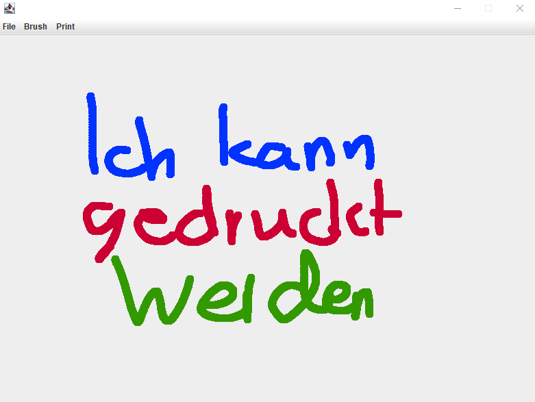
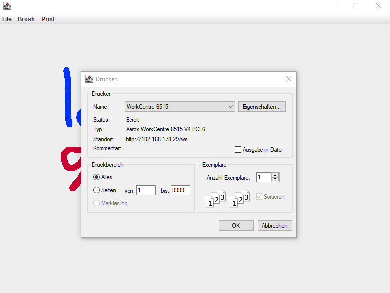
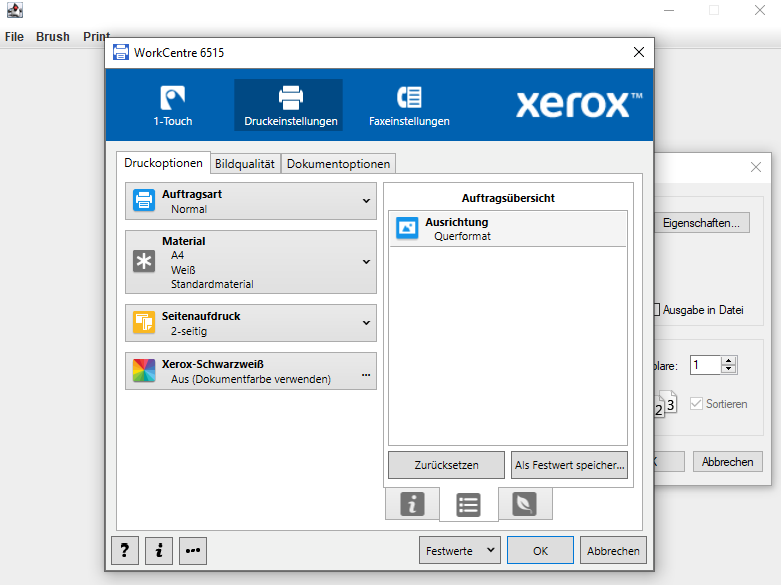

# Paint
Ein kleines Paint-Programm, was ich als Nebenprojekt gemacht habe. Leider müssen die Positionen der Punkte in einer List gespeichert werden, da die repaint()-Methode sonst alles löschen würde. Der Vorteil daran ist jedoch, dass die Bilder so auch als .png gespeichert werden können. Die Pinselfarbe und Größe lassen sich anpassen.

Nachdem man mit seinem Kunstwerk, wie diesem hier, fertig ist, kann man die Datei über die Option File > Save speichern.

## Update
Nach einem kleinem "Update" lassen sich die Bilder jetzt auch drucken! Die Bilder werden (leider) mit einem etwas dickerem Rand gedruckt, der jedoch nichts abschneidet.
Das Fenster ist jetzt leider nicht mehr resizable, da ich Probleme beim drucken von Bildern mit einer anderen Aspect Ratio als 16:10 hatte. Daher ist das Fenster
jetzt 800px * 600px groß. Dies kann jedoch irgendwann vielleicht behoben werden. Eine weitere Neuigkeit dieses "Updates" ist die "Clear" Funktion, die man unter File > Clear finden kann. Sie "säubert" den kompletten Inhalt des JPanels.

Hier ist die "neue" GUI zu sehen.

Über die Menu Bar kann man den Drucker Dialog öffnen (Print > Printer Dialog).

Über den Dialog lassen sich natürlich auch die Einstellungen öffnen.
