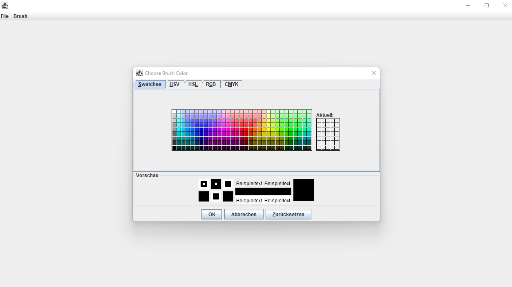
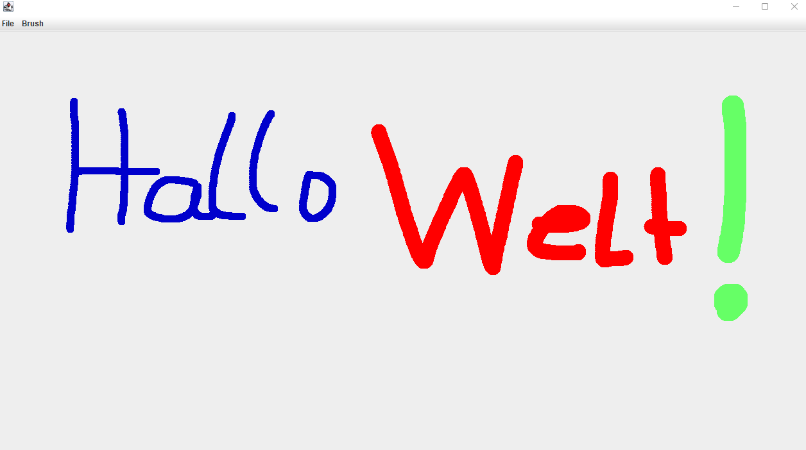
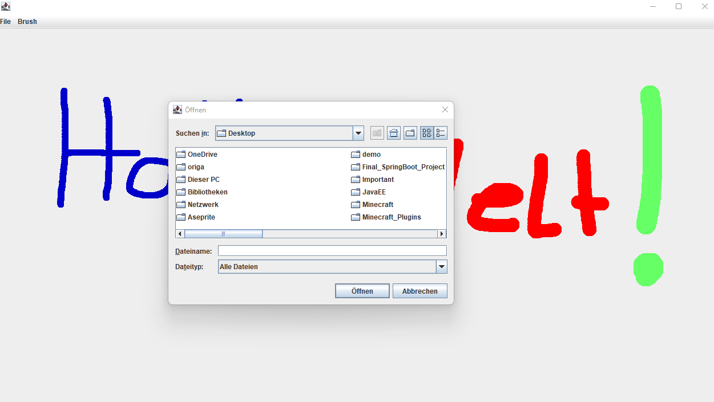

# Paint
Ein kleines Paint-Programm, was ich als Nebenprojekt gemacht habe. Leider müssen die Positionen der Punkte in einer List gespeichert werden, da die repaint()-Methode sonst alles löschen würde. Der Vorteil daran ist jedoch, dass die Bilder so auch als .png gespeichert werden können. Die Pinselfarbe und Größe lassen sich anpassen.

Nachdem man mit seinem Kunstwerk, wie diesem hier, fertig ist, kann man die Datei über die Option File > Save speichern.

